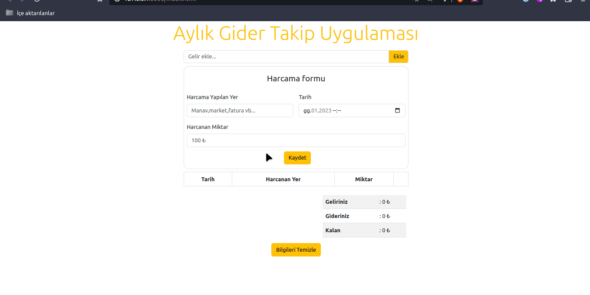

# Aylık Gider Takip Uygulaması

###### Beklenenler : 
<ul>
    <li>Kullanıcının gelir ekleyebileceği bir input alanı</li>
    <li>Kullanıcının harcamalarını detaylı bir şekilde gireceği harcama formu ve formdaki alanların hepsinin girilmesi zorunlu olması. Harcama yapılan yer, harcama tarihi , harcama miktarı...</li>
    <li>Harcama listesinin görülebileceği alan</li>
    <li>Tarih seçerken sadece içinde bulunulan ay'ın günlerini seçebilme</li>
    <li>Harcamayı sildikten sonra ekranda bir uyarı divi açılıp 3 saniye sonra uyarı divinin ekrandan silinmesi</li>
    <li>Toplam gelir,toplam harcama ve kalan paranın gösterildiği alan</li>
    <li>Verilerin localstorage da saklanması</li>
    <li>Ay bittiğinde kullanıcının tüm gelir bilgisi ve gider bilgilerini temizleyebileceği bir buton.</li>
</ul>

